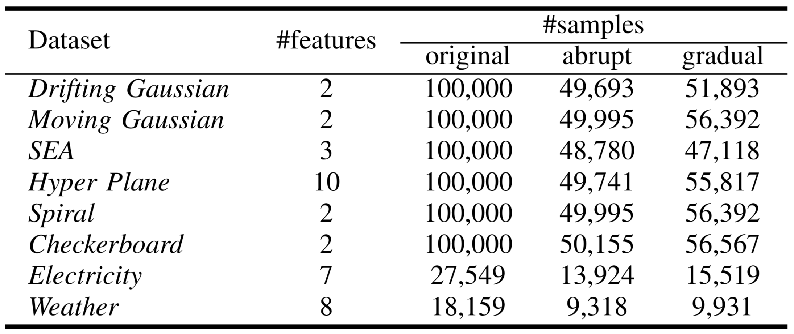
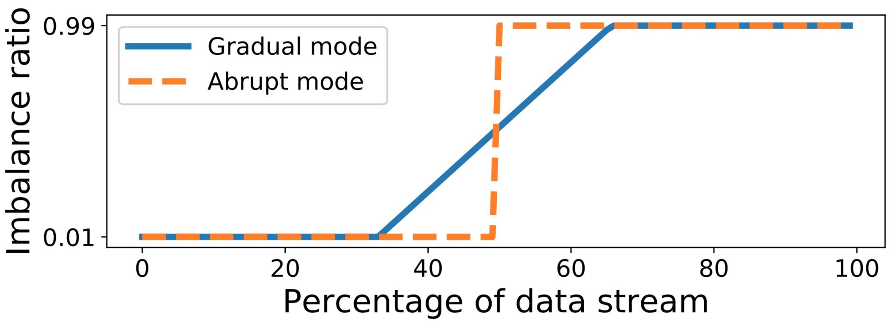

## Introduction

Python code for ACDWM (Adaptive Chunk-based Dynamic Weighted Majority)

Author: [Yang Lu](https://jasonyanglu.github.io/)

Contact: lylylytc@gmail.com

## Run

Run Python 3 by:

```shell
main.py dataset_name.npz
```

The dataset can be chosen by:

drifting_gaussian_abrupt.npz
drifting_gaussian_gradual.npz
elec2_abrupt.npz
elec2_gradual.npz
hyperP_abrupt.npz
hyperP_gradual.npz
moving_gaussian_abrupt.npz
moving_gaussian_gradual.npz
noaa_abrupt.npz
noaa_gradual.npz
rotcb_abrupt.npz
rotcb_gradual.npz
rotsp_abrupt.npz
rotsp_gradual.npz
sea_abrupt.npz
sea_gradual.npz

## Datasets 

### Information

* Moving Gaussian: This data stream consists of two Gaussian distributed classes with identity covariance and 2 dimensions. The initial coordinates of the mean of the two classes are [5,0] and [7,0]. They gradually move to [-5,0] and [-3,0] from the beginning to the half of the stream and then move back to the initial coordinates.

* Drifting Gaussian: It is a linear combination of three Gaussian components and one of them is the minority class. The mean and variance of the Gaussian components are varying along all time.

* SEA: It contains three attributes ranging from 0 to 10. Only the first two attributes are related to the class that is determined by $attr_1+attr_2\le \alpha$. The third attribute is treated as noise. The control parameter $\alpha$ is set at 15 for the first 1/3 and the last 1/3 chunks, and 5 for the second 1/3 chunks.

* Hyper Plane: The gradually changed concepts are calculated by $f(\mathbf{x})=\sum_{i=1}^{d-1}a_i\cdot\frac{x_i+x_{i+1}}{x_i}$, where the dimension $d=10$ and $a_i$ is used to control the decision hyperplane.

* Spiral: There are four spirals are rotating with a size-fixed two dimensional window. The position of the spirals are used to predict the class.

* Checkerboard: It is a non-linear XOR classification problem. The data stream is produced by selecting from a size-fixed window in the rotating checkerboard.

* Electricity: This dataset contains the changes of electricity price according to the time and demand in New South Wales, Australian. The class label is determined by the change of price over the last 24 hours.

* Weather: This dataset contains the weather information over 50 years in Bellevue and Nebraska. The task is to predict whether a day is rainy or not.

<div style="text-align:center"></div>

### Drift Modes



In the experiments, the imbalance ratio is changed by two prior drift modes:

* Abrupt drift: The imbalance ratio is initially set at 0.01. After half of the data stream, the imbalance ratio suddenly changes to 0.99, namely the majority class becomes to the minority class with imbalance ratio 0.01. The prequential measures are reset at the position of the abrupt drift.

* Gradual drift: The imbalance ratio is initially set at 0.01. After 1/3 of the data stream, the imbalance ratio starts to gradually increase until 0.99 at 2/3 of the data stream. The prequential measures are reset at the starting and ending position of the gradual drift.

The imbalance ratio here refers to the percentage of positive class samples. To control the imbalance ratio, undersampling is done on every 1000 samples in the original data stream. The majority class is undersampled if the original imbalance ratio on this chunk is smaller than the assigned imbalance ratio, and the minority class is undersampled vice versa. As the original imbalance ratio of each dataset is different, the drift position after undersampling is also different.


## Paper

Please cite the paper if the codes are helpful for you research.

Yang Lu, Yiu-ming Cheung, and Yuan Yan Tang, “Adaptive Chunk-based Dynamic Weighted Majority for Imbalanced Data Streams with Concept Drift”, in *IEEE Transactions on Neural Networks and Learning Systems*, to be appear.